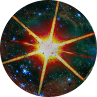

# cosmicplayground [](https://cosmicplayground.org)

> tools and toys for expanding minds
> [:milky_way: cosmicplayground.org :comet:](https://cosmicplayground.org)

```svelte
// work in progress
// current status: there's barely anything here yet, but there's not _nothing_
```

_cosmicplayground_ (CPG) is an experimental **work in progress** website
exploring interactive learning with over-engineered web tech.
It plays with explorable systems, generative creativity, and other neat stuff
in domains like math, dataviz, ear training, and music theory.
It explores in many directions, but the general goal
is to help us learn, create, and grow.


[The code](https://github.com/ryanatkn/cosmicplayground)
is open source and permissively licensed,
[the website](https://cosmicplayground.org) is free to use,
it's easy and cheap to self-host,
and we hope to grow a community of contributors.

## participate

CPG hopes to bring together likeminded explorers
sharing ideas, creations, and experiences. Participation takes many forms:

- play around! [:octopus::beetle:](https://cosmicplayground.org)
- report problems, ask questions, give feedback, and discuss ideas in
  [the GitHub issues](https://github.com/ryanatkn/cosmicplayground/issues)
- join the subreddit at [/r/cosmicplayground](https://reddit.com/r/cosmicplayground)
- tweet [@cpg_org](https://twitter.com/cpg_org)
- say hi on [Discord](https://discord.gg/57XP5Pv)
- contribute code and other assets like graphics and audio.
  Creative Commons has a great webpage to help you
  [choose a license](https://creativecommons.org/choose/)
  if you want to protect your creations commercially or otherwise.
  See [the asset credits](docs/assets.md) and
  [contributors](docs/contributors.md) for more.
  I'm not sure what contributions I'll solicit yet,
  but if you have something cool in mind please share!
- email [cosmicplayground.org@gmail.com](mailto:cosmicplayground.org@gmail.com)
- donate on [Patreon](https://patreon.com/ryanatkn)
- [:milky_way: cosmicplayground.org :comet:](https://cosmicplayground.org)

## develop

To play with the code, you'll need node 12+;

```bash
npm install
npm start
# open your browser to localhost:8999
```

## credits :turtle: <sub>:turtle:</sub><sub><sub>:turtle:</sub></sub>

Made with [`svelte`](https://github.com/sveltejs/svelte),
[`typescript`](https://github.com/microsoft/TypeScript),
[`rollup`](https://github.com/rollup/rollup),
[`prettier`](https://github.com/prettier/prettier),
[`node`](https://nodejs.org),
[`github`](https://github.com), and [`git`](https://git-scm.com/).

This project relies on content and code that has been generously
made freely available through permissive licensing, like
[NASA's Hubble imagery](https://www.spacetelescope.org)
and open source web stuff.
See [docs/assets.md](docs/assets.md) for
the complete list of non-code assets and their credits,
[package.json](package.json) for the code powering things,
and [docs/contributors.md](docs/contributors.md)
for the list of people helping it all go.

> :rainbow::sparkles: did you know? `emoji` can be punctuation :snail: neat huh

## license

[MIT](license)

Graphics, sounds, and other assets may have licenses that restrict usage
as specified in [the asset credits](docs/assets.md).
